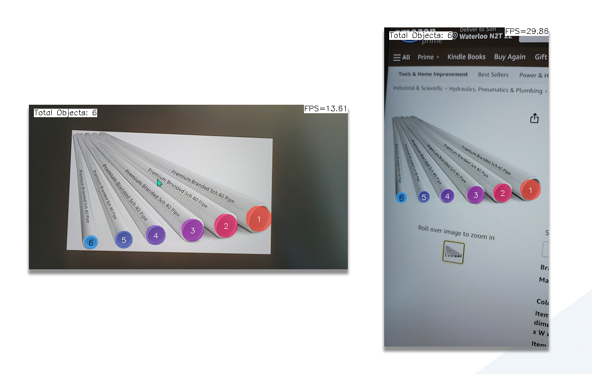

# Warehouse-Helper-Pipe
 The aim of the warehouse helper app is to assist workers counting objects. The first version will be limited to count pipe ony. The next target will be boxes and other things such as clothes, and nail supplies.

-- Thanks Dad for giving me the idea 🙌.

Technologies:
- Android
- ncnn
- yolov8

# Apk File

**v0.0.0.1**: Count pipe, and apply takescreenshot function [Download here](https://github.com/lamegaton/warehouse-helper/releases/tag/v0.0.0.1) 

# Demo

https://github.com/lamegaton/Warehouse-Helper/assets/5988492/e07e2326-8995-410d-8657-ff9eb137d048

## Screenshots
Screenshots are save in Gallery under Pipe directory

  

# Source and Attribute
<a href="https://www.flaticon.com/free-icons/zoology" title="zoology icons">Zoology icons created by Freepik - Flaticon</a>

<a href="https://www.flaticon.com/free-icons/ui" title="ui icons">Ui icons created by Smashicons - Flaticon</a>

<a href="https://www.freepik.com/free-psd/premium-mobile-phone-screen-mockup-template_3891016.htm#query=mockup%20phone&position=6&from_view=keyword&track=ais">Image by rawpixel.com</a> on Freepik
